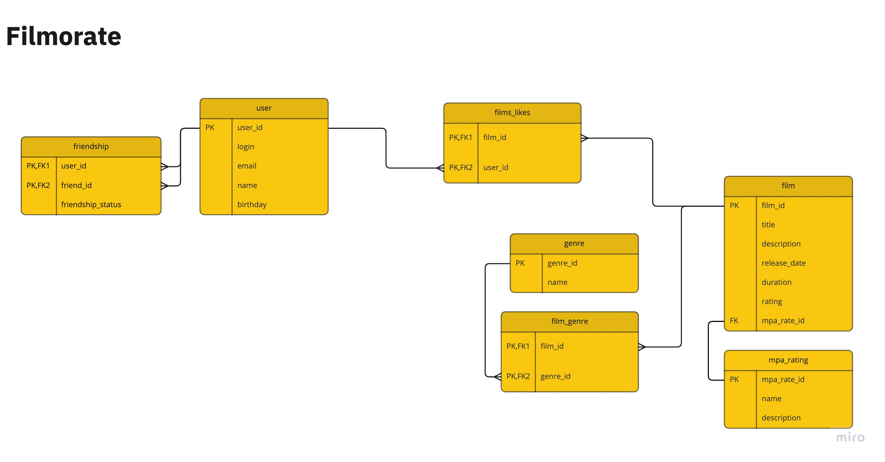

# java-filmorate

### Shown a filmorateDB er-diagram

### Several SQL requests:
#### *shows film's title whose MPA Rating equal to 'PG-13'*
SELECT f.title \
FROM film f \
INNER JOIN mpa_rating mr on f.mpa_rate_id=mr.mpa_rate_id
WHERE mr.name='PG-13'  
#### *shows users whose birthday is equal or greater than 01-JAN-2020:*
SELECT * FROM user \
WHERE birthday >='20200101'
#### *shows film's title and genre's list for each film whose genre name equal to 'Comedy':*
SELECT f.title, g.name \
FROM film f \
INNER JOIN film_genre fg on f.film_id=fg.film_id \
INNER JOIN genre g on fg.genre_id=g.genre_id \
WHERE g.name='Comedy'