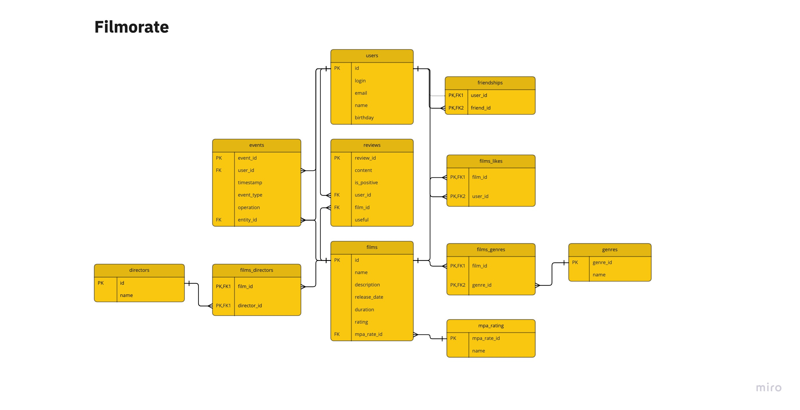

# java-filmorate

### Shown a filmorateDB er-diagram

### Several SQL requests:
#### *shows film's title whose MPA Rating equal to 'PG-13'*
<pre>
SELECT f.name \
FROM films f \
INNER JOIN mpa_rating mr on f.mpa_rate_id=mr.mpa_rate_id
WHERE mr.name='PG-13'
</pre>
#### *shows users whose birthday is equal or greater than 01-JAN-2020:*
<pre>
SELECT * FROM users \
WHERE birthday >='20200101'
</pre>
#### *shows film's title and genre's list for each film whose genre name equal to 'Comedy':*
<pre>
SELECT f.name, g.name as genre_name \
FROM films f \
INNER JOIN films_genres fg on f.id=fg.film_id \
INNER JOIN genres g on fg.genre_id=g.genre_id \
WHERE g.name='Комедия'
</pre>>