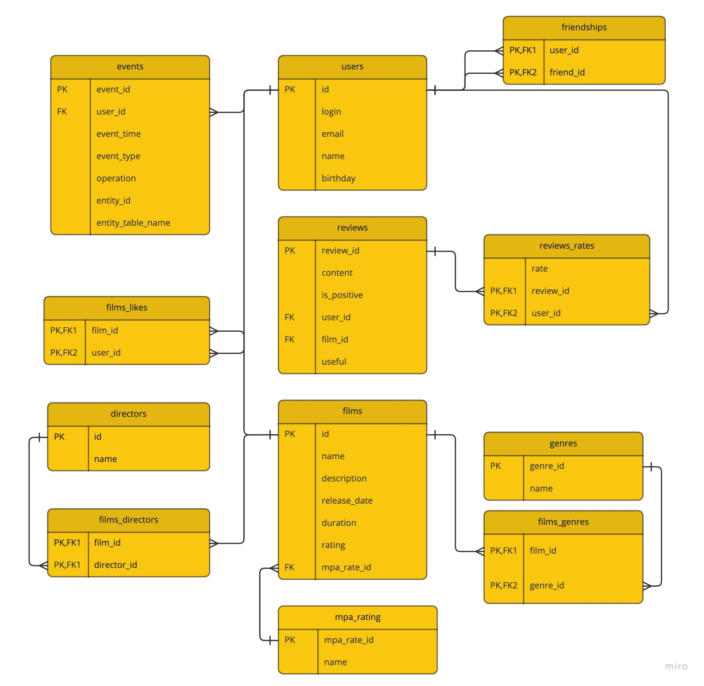

# Filmorate

### Description

Imagine that after a hard day you decided to relax and spend the evening watching a movie. Delicious food is already 
being prepared, your favorite blanket is comfortably curled up on a chair — and you still haven't chosen what to see!
There are a lot of films — and every year there are more and more. The more of films, the more different ratings. 
The more ratings, the harder it is to make a choice.
This application is a backend for a service that will work with movies and user ratings, as well as return 
the X-top movies recommended for viewing. Now neither you nor your friends will have to think for a long time about 
what to watch in the evening.

#### App work with:
<table>
  <tbody>
    <tr>
      <th><b>Users</b></th>
      <th><b>Films</b></th>
      <th><b>Reviews</b></th>
    </tr>
    <tr>
        <td>
            <ul><li>Add / Remove;</li>
            <li>Update;</li>
            <li>Show all users;</li>
            <li>Show user information;</li>
            <li>Add friends;</li>
            <li>Remove friends;</li>
            <li>Show friends of particular user;</li>
            <li>Show common friends;</li>
            <li>Show user feed.</li></ul>
        </td>
        <td>
            <ul><li>Add / Remove;</li>
            <li>Update;</li>
            <li>Show all films;</li>
            <li>Show film information;</li>
            <li>Add likes;</li>
            <li>Remove likes;</li>
            <li>Change genres and mpa;</li>
            <li>Show top films;</li>
            <li>Search films by title and/or director;</li>
            <li>Show films by director;</li>
            <li>Get common films with friends.</li></ul>
        </td>
        <td>
            <ul><li>Add / Remove;</li>
            <li>Update;</li>
            <li>Show user reviews;</li>
            <li>Show film reviews;</li>
            <li>Add likes;</li>
            <li>Remove likes;</li>
            <li>Add dislikes;</li>
            <li>Remove dislikes.</li></ul>
        </td>
    </tr>
    <tr>
      <th><b>Genres</b></th>
      <th><b>Motion Picture Association</b></th>
      <th><b>Directors</b></th>
    </tr>
    <tr>
        <td>
            <ul><li>Show all genres;</li>
            <li>Show genre information.</li></ul>
        </td>
        <td>
            <ul><li>Show all mpa;</li>
            <li>Show mpa information.</li></ul>
        </td>
        <td>
            <ul><li>Add / Remove;</li>
            <li>Update;</li>
            <li>Show all directors;</li>
            <li>Show director information.</li></ul>
        </td>
    </tr>
  </tbody>
</table>
 
 

---

### Documentation
#### Swagger API
Swagger API could be found on the link http://localhost:8080/swagger-ui/index.html in running project, or in 
static file index.html in the root directory
 
 

#### DB Model

#### Several SQL requests:
##### Shows film's title whose MPA Rating equal to 'PG-13'
<pre>
SELECT f.name \
FROM films f \
INNER JOIN mpa_rating mr on f.mpa_rate_id=mr.mpa_rate_id
WHERE mr.name='PG-13'
</pre>
##### Shows users whose birthday is equal or greater than 01-JAN-2020:
<pre>
SELECT * FROM users \
WHERE birthday >='20200101'
</pre>
##### Shows film's title and genre's list for each film whose genre name equal to 'Comedy':
<pre>
SELECT f.name, g.name as genre_name \
FROM films f \
INNER JOIN films_genres fg on f.id=fg.film_id \
INNER JOIN genres g on fg.genre_id=g.genre_id \
WHERE g.name='Комедия'
</pre>